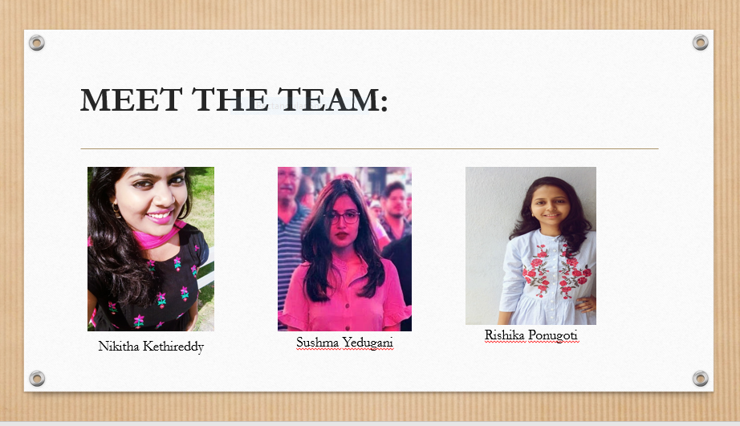

# Group Members-Section 04

1. Sushma Yedugani
2. Nikitha kethireddy
3. Rishika Ponugoti

# Group 2

# Tasks Assigned

- Sushma Yedugani-Courses
- Nikitha kethireddy-Section
- Rishika Ponugoti-Student

# Developers

- [Sushma Yedugani](https://sushma95.github.io/about-me/)
- [Nikitha Kethireddy](https://nikithakethireddy1996.github.io/p2-styled-site/)

# Dev Tools

- Chrome browser
- Visual Studio Code
- VS Code Extension: ESLint

# Install Dependencies and Start App

Open PowerShell here as admin and run: `npm install`.

Start app with nodemon: `nodemon app.js`.

# Terms

- .gitignore
- npm install
- node_modules
- package-lock.json
- nodemon
- routing
- data seeder
- MVC
- controller
- model
- views
- json (JavaScript Object Notation) - double-quote strings, no comments

# Resources

- [Bootstrap Material Design CDN](https://mdbootstrap.com/md-bootstrap-cdn/)
- [JavaScript Standard Style Validator](https://standardjs.com/demo.html)
- [ESLint](https://eslint.org/)